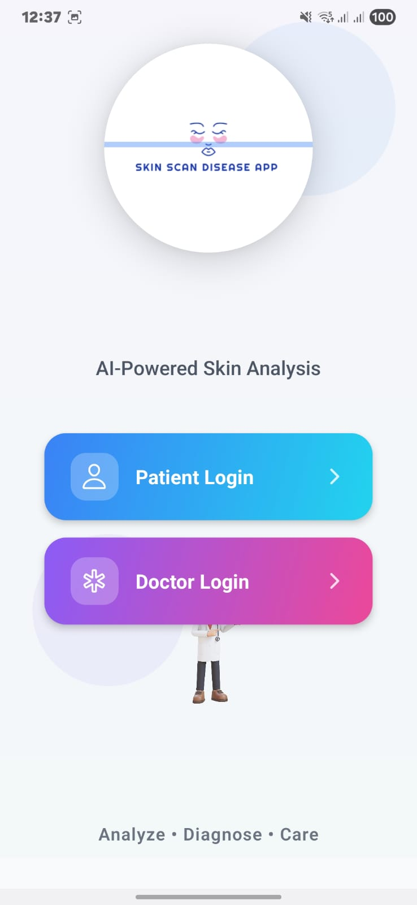
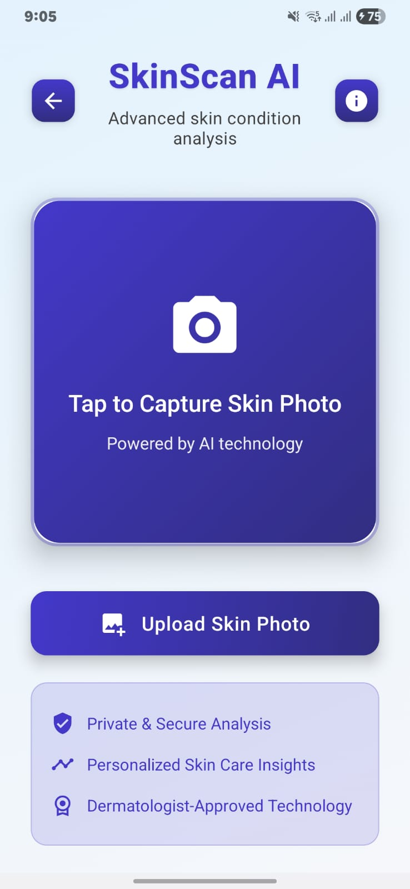

### 1. GetStartScreen.jpg
  
*App starting screen – welcome interface*

### 2. PatientLogin.jpg
  
*User login screen for patients*

### 3. Doctor And Patient Button .jpg
  
*Select user role – doctor/patient*

### 4. Dashboard.jpg
  
*Main dashboard with quick options*

### 5. SkinScan UplaodCapture.jpg
  
*Upload or capture skin image*

### 6. Analysis.jpg
  
*Scanning progress – analyzing screen*

### 7. Analysis_Disease.jpg
  
*Detected disease with percentage result*

### 8. DiseaseDetailTips.jpg
  
*Care guide – symptoms, causes, tips*

### 9. FindDoctor.jpg
  
*Search available dermatologists list*

### 10. DoctorDetail.jpg
  
*Doctor profile – details overview*

### 11. DoctorDetail2.jpg
  
*More doctor information – ratings etc.*

### 12. bookingappointment.jpg
  
*Appointment booking screen interface*

### 13. FindSlot.jpg
  
*Select available doctor time slots*

### 14. AllAppointmentbooking.jpg
  
*All booked appointments listed*

### 15. Appointmnet_Viewdetails.jpg
  
*View complete appointment details*

### 16. chatLimtedmessage.jpg
  
*Limited chat before doctor approval*

### 17. Feedback.jpg
  
*Give feedback after appointment*

### 18. SettingPateintProfile.jpg
  
*User profile – settings and details*

### 19. filegenrate.jpg
  
*Generated prescription or QR slip*

### 20. writePresception.jpg
  
*Doctor writes online prescription*

### 21. createSlottime.jpg
  
*Doctor creates available timeslots*

### 22. DoctorLoginDashboard.jpg
  
*Doctor dashboard – appointment control*

### 23. doctorProfile.jpg
  
*Doctor profile information page*

### 24. ViewRequestappointmnet.jpg
  
*Doctor views appointment requests*

### 25. RandomObject.jpg
  
*Shows warning: upload valid skin image*
